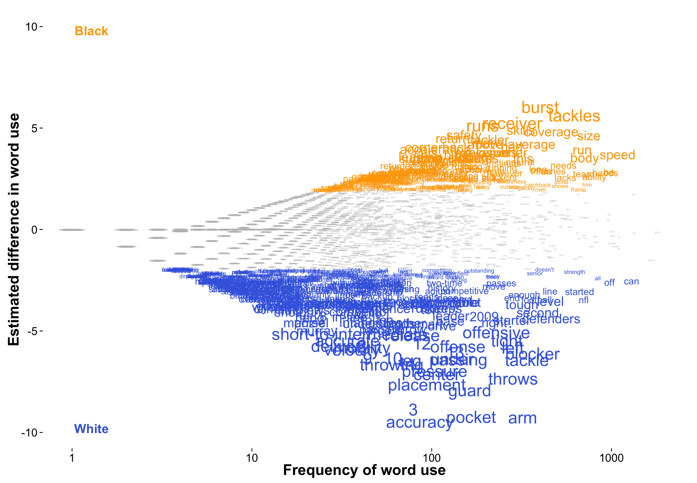
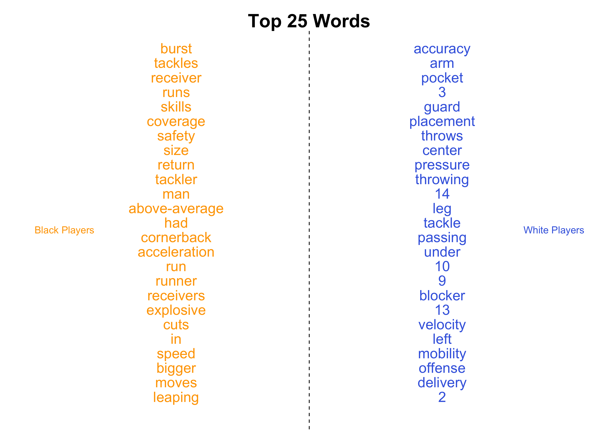

# nfl_draft_text

## About
This repository contains code to extend Deadspin's [analysis](http://deadspin.com/which-words-are-used-to-describe-white-and-black-nfl-pr-1573683214) of the language used to describe white and black nfl prospects. Instead of arbitrarily choosing a list of words to examine, I use a statistical technique that enables us to identify the words which best distinguish scouting reports about black prospects from reports about white players. More details about this method can be found [here](http://languagelog.ldc.upenn.edu/myl/Monroe.pdf).

### Content
`R/`: Contains code to get the data from deadspin repo, clean the data, estimate differences in language used to describe prospects, and plot these estimates.

`figures/`: Contains the figures

